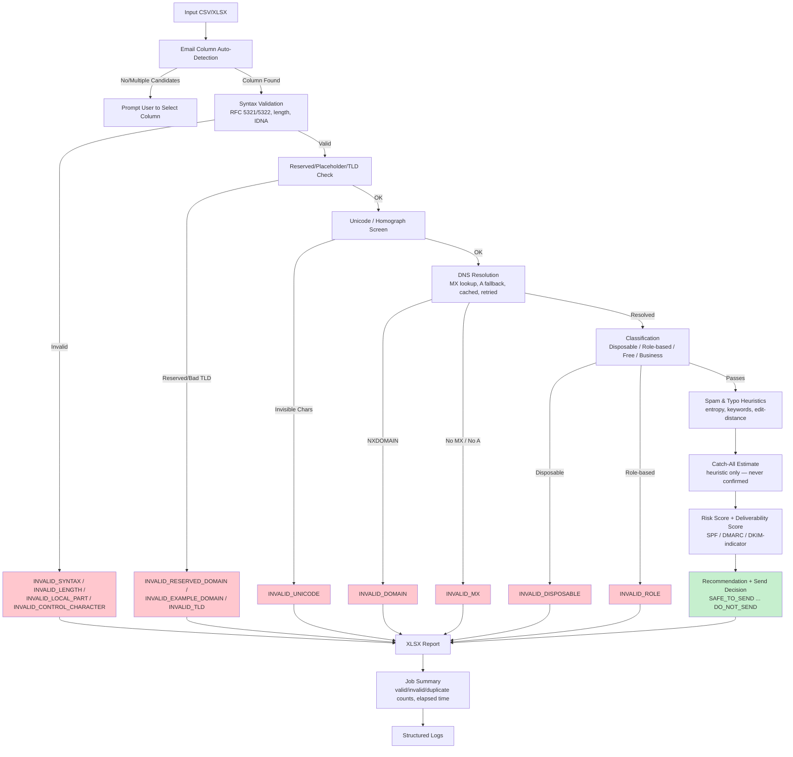

# Email Validation Service

A production-grade, offline-first email validation engine. Upload a CSV/XLSX
of email addresses and get back an XLSX with syntax, DNS/MX, disposable,
role-based, spam-risk, and deliverability signals appended as new columns —
via CLI, REST API, or a minimal drag-and-drop web UI.

**No paid APIs. No SMTP/Google/Microsoft credentials required.** The only
network activity is standard DNS resolution (MX/A/TXT lookups) against
public resolvers; everything else runs fully offline against bundled
reference data.

---

## What this tool does *not* do (read this first)

- **It never confirms a mailbox exists.** Doing that correctly requires a
  live SMTP `RCPT TO` handshake with credentials this project deliberately
  avoids. Every result carries `Mailbox Status = MAILBOX_UNKNOWN` — the tool
  reports **domain valid / MX valid**, not "mailbox exists," and it will
  never claim otherwise.
- **Catch-all detection is a heuristic, not a fact.** Without SMTP probing,
  "does this domain accept anything sent to it" can only be estimated from
  weak signals (e.g. known catch-all-prone hosting MX patterns). Results are
  `UNKNOWN` or `POSSIBLE_CATCH_ALL` — never "confirmed."
- **The disposable-domain and DKIM-selector lists are seed lists**, not
  exhaustive registries. They're designed to be easy to extend (see
  [Extending the data](#extending-the-data)) rather than to claim completeness.
- **The homograph/confusables check is a small, conservative screen** (mixed
  Latin/Cyrillic/Greek scripts + a short Cyrillic look-alike set), not a full
  Unicode Technical Standard #39 confusables implementation.

---

## Architecture

```
email_validator/
├── main.py                      # CLI entry point
├── app/
│   ├── config/settings.py       # Pydantic v2 settings (env-var driven)
│   ├── models/
│   │   ├── enums.py              # ValidationStatus, DnsStatus, Recommendation...
│   │   └── schemas.py            # Pydantic v2 result models
│   ├── data/                     # Bundled reference data (all offline)
│   │   ├── disposable_domains.txt
│   │   ├── free_providers.txt
│   │   ├── role_based_prefixes.txt
│   │   ├── reserved_domains.txt
│   │   ├── spam_keywords.txt
│   │   ├── typo_domain_map.json
│   │   └── mx_provider_map.json
│   ├── validators/                # Pure, unit-testable check functions
│   │   ├── syntax.py              # RFC 5321/5322 + IDNA/punycode
│   │   ├── domain.py              # Reserved/invalid TLD checks
│   │   ├── classification.py      # Disposable / free / role / business
│   │   ├── unicode_checks.py      # Mixed-script / invisible-char / homograph
│   │   ├── typo.py                # Known-typo map + edit-distance fallback
│   │   └── spam.py                # Entropy/keyword spam heuristics
│   ├── dns/
│   │   ├── resolver.py            # MX→A fallback, SPF/DMARC/DKIM probes, retries
│   │   └── cache.py               # TTL-aware in-memory DNS cache
│   ├── services/
│   │   ├── validation_service.py  # Single-email orchestrator
│   │   ├── risk_scoring.py        # Risk / deliverability / recommendation
│   │   ├── catch_all.py           # Non-authoritative catch-all estimate
│   │   └── file_service.py        # CSV/XLSX I/O, column auto-detection
│   ├── workers/
│   │   └── batch_processor.py     # ThreadPoolExecutor batch runner + dedupe
│   ├── utils/
│   │   ├── data_loader.py         # Cached loaders for app/data/*
│   │   ├── mx_provider.py         # MX host → friendly provider name
│   │   └── logging_config.py      # Structured logging setup
│   └── api/
│       └── main.py                # FastAPI app: REST API + web UI
└── tests/                         # pytest suite (offline-safe by default)
```

Each `validators/*` module is a pure function with no I/O, so it's trivially
unit-testable. `services/validation_service.py` is the only place that wires
syntax → domain → classification → DNS → risk scoring together for a single
email. `workers/batch_processor.py` fans that out across a thread pool
(DNS lookups are I/O-bound, so threads — not processes — are the right tool)
and de-duplicates identical addresses before doing DNS work twice.

---

## Installation

```bash
python3 -m venv .venv
source .venv/bin/activate
pip install -r requirements.txt
```

### Docker

```bash
docker compose up --build
# or
docker build -t email-validator .
docker run -p 8000:8000 email-validator
```

---

## Usage

### CLI

```bash
python main.py input.xlsx output.xlsx
python main.py input.csv output.xlsx
python main.py input.csv output.xlsx --column "Email Address"
python main.py input.csv output.xlsx --no-dns          # syntax-only, no network
python main.py input.csv output.xlsx --no-deep-dns      # skip SPF/DMARC/DKIM probes
python main.py input.csv output.xlsx --workers 64
```

A live progress bar is printed to stdout; a structured summary (counts,
elapsed time) is logged on completion.

### REST API

```bash
uvicorn app.api.main:app --reload
```

- `GET /` — drag-and-drop web UI
- `POST /validate` — multipart upload (`file`, optional `email_column`,
  `check_dns`, `deep_dns_checks`) → streams back the validated `.xlsx`
- `POST /inspect-columns` — upload a file and get back its column names plus
  auto-detected email column, for building a column picker when detection is
  ambiguous
- `POST /validate-single?email=...` — validate one address, returns JSON
- `GET /health` — liveness + DNS cache stats

Interactive API docs: `http://localhost:8000/docs`

### Python

```python
from app.services.validation_service import validate_single_email

result = validate_single_email("jane.doe@example-company.com")
print(result.validation_status, result.risk_score, result.recommendation)
```

---

## Input format

The email column is auto-detected (case-insensitive) among: `Email`,
`Email Address`, `email_address`, `Email Id`, `email_id`, `e-mail`,
`emailaddress`, and similar variants. If more than one plausible column is
found, the CLI/API will list the candidates and ask you to specify
`--column` / `email_column` explicitly rather than guessing.

All original columns are preserved untouched in the output; validation
columns are appended.

## Output columns

| Column | Meaning |
|---|---|
| Normalized Email | NFC-normalized, lowercase-domain form |
| Validation Status | See status list below |
| Primary Tag / Secondary Tag | Coarse-grained groupings for quick filtering |
| Syntax Valid, Domain Exists, MX Exists, DNS Status | Raw check outcomes |
| Disposable, Role Based, Free Provider (+ name), Business Email, International | Classification flags |
| Typo Suggestion | Suggested domain correction, if any |
| Catch All Possible | `UNKNOWN` or `POSSIBLE_CATCH_ALL` — never confirmed |
| Mailbox Status | Always `MAILBOX_UNKNOWN` (see limitations) |
| Spam Score / Risk Score | 0–100 heuristic scores |
| Reason | Human-readable explanation of the status |
| Recommendation | `SAFE_TO_SEND` … `DO_NOT_SEND` / `INVALID` |
| Deliverability Score / Send Decision | `SEND` / `REVIEW` / `SKIP` |
| Domain Reputation Flags | e.g. `DISPOSABLE_DOMAIN`, `POSSIBLE_HOMOGRAPH` |
| Has SPF / Has DKIM Indicator / Has DMARC | DNS TXT presence checks |
| MX Provider | Best-effort provider name from MX hostname |
| DNS Response Time (ms), Validation Timestamp, Duplicate Count | Operational/audit metadata |

### Validation statuses

`VALID`, `VALID_HIGH_CONFIDENCE`, `VALID_BUSINESS`, `VALID_FREE`,
`INVALID`, `INVALID_SYNTAX`, `INVALID_DOMAIN`, `INVALID_TLD`, `INVALID_MX`,
`INVALID_DISPOSABLE`, `INVALID_ROLE`, `INVALID_LENGTH`,
`INVALID_LOCAL_PART`, `INVALID_DOMAIN_PART`, `INVALID_UNICODE`,
`INVALID_CONTROL_CHARACTER`, `INVALID_RESERVED_DOMAIN`,
`INVALID_EXAMPLE_DOMAIN`, `INVALID_IP_LITERAL`, `UNKNOWN`, `SUSPICIOUS`,
`RISKY`.

---

## Performance

- **Streaming/chunked CSV reads** (`app/services/file_service.py`) avoid
  loading huge files entirely into memory when only row-by-row scanning is
  needed.
- **ThreadPoolExecutor** for DNS lookups (default 32 workers, configurable
  via `EMAILVAL_DNS_THREAD_POOL_WORKERS`), since DNS is I/O-bound.
- **De-duplication before DNS**: identical addresses (case-insensitive,
  post-normalization) are validated once; the result is fanned back out to
  every occurrence, and a `Duplicate Count` column reports how many times
  each address appeared.
- **TTL-aware in-memory DNS cache** (`app/dns/cache.py`) avoids re-resolving
  the same domain across rows within a run.
- **Retries with backoff** on DNS timeouts (`EMAILVAL_DNS_MAX_RETRIES`,
  `EMAILVAL_DNS_RETRY_BACKOFF_SECONDS`).

For 100k+ row files, run with `--workers` tuned to your resolver's capacity,
and consider `--no-deep-dns` (skips SPF/DMARC/DKIM probing, which issues
extra TXT queries) if you only need MX-level confidence.

---

## Extending the data

All reference data lives in `app/data/` as plain text/JSON so it can be
edited without touching code:

- `disposable_domains.txt` — one domain per line. Append new ones (and
  restart, or call `app.utils.data_loader.add_disposable_domain()` at
  runtime — it persists to disk and clears the cache).
- `free_providers.txt`, `role_based_prefixes.txt`, `reserved_domains.txt`,
  `spam_keywords.txt` — same one-per-line format.
- `typo_domain_map.json` — `{"typo.domain": "correct.domain"}`.
- `mx_provider_map.json` — `{"mx-hostname-fragment": "Friendly Name"}`.

---

## Testing

```bash
pytest
pytest --cov=app --cov-report=term-missing
```

The suite is offline-safe by default: DNS-dependent code paths are exercised
with `check_dns=False` so `pytest` never needs live network access. If you
want to test real DNS/MX behavior, run the CLI or API manually against a
handful of real domains.

> **Note on this delivery:** this environment had no outbound network
> access available to `pip install` third-party packages (FastAPI, dnspython,
> email-validator, tldextract, pydantic, pytest), so the suite could not be
> executed here. Every file was syntax-checked (`python -m py_compile`) and
> the logic was reviewed carefully, but please run `pip install -r
> requirements.txt && pytest` in your own environment before deploying.

---

## Limitations (explicit, by design)

1. **Mailbox existence is never verified or claimed.** SMTP verification is
   out of scope for this project (no credentials, no paid APIs). Extending
   `app/dns/resolver.py` with a real SMTP `RCPT TO` probe is the natural
   place to add this later, behind a clearly-labeled opt-in flag.
2. **Catch-all detection is heuristic-only** (`app/services/catch_all.py`).
3. **Disposable-domain and DKIM-selector coverage is a seed list**, not
   exhaustive — extend as described above.
4. **Homograph detection is a lightweight screen**, not a full UTS #39
   confusables table.
5. **WHOIS/domain-age is not implemented** (would require an external data
   source); `Domain Reputation Flags` covers what's derivable from DNS alone.
6. **tldextract runs against its bundled offline suffix-list snapshot**
   (`suffix_list_urls=()`), so brand-new TLDs added to the public suffix
   list after that snapshot won't be recognized until the library is
   updated.



